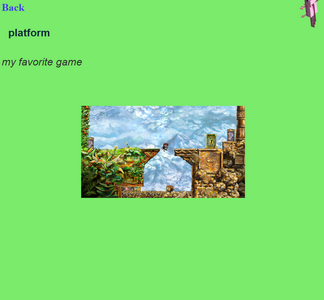

# Simple Webpage

A minimalist two-page web application demonstrating basic form input handling, dynamic content rendering, and responsive design using HTML, CSS, and JavaScript.

---

## 🎯 Project Overview

This project implements a small interactive webpage where users enter a phrase, select an element from a dropdown, and then see a second page displaying their input with dynamic styling and images based on the chosen element.

---

## 🛠️ Features

- **Main page layout:**
  - Header
  - Textbox with placeholder (e.g., "enter phrase here")
  - Select box with 4 element options (emoji or text)
  - Submit button
  - All elements styled with at least 32px Helvetica font

- **Result page:**
  - Displays the entered phrase and chosen element one under another
  - Changes background color based on the selected element (e.g., red for fire)
  - Shows a random image from the selected element category, sized at 50% of the window width and responsive to resizing
  - Displays a fixed-position picture in the upper-right corner of the page, independent of scrolling and resizing
  - Small axolotl picture in the corner spins; its rotation angle equals the number of characters in the input text multiplied by 10 degrees
  - Includes a hyperlink back to the main page

---

## 🕹️ Categories

The elements correspond to gaming categories:

- FPS
- Platform
- Puzzle
- Mobile

Each category has its own set of images to randomly display on the results page.

---
🖼️ Screenshot




## 🚀 How to Run

1. Clone the repository:

   ```bash
   git clone https://github.com/itsasko/simple-webpage.git
   cd simple-webpage
